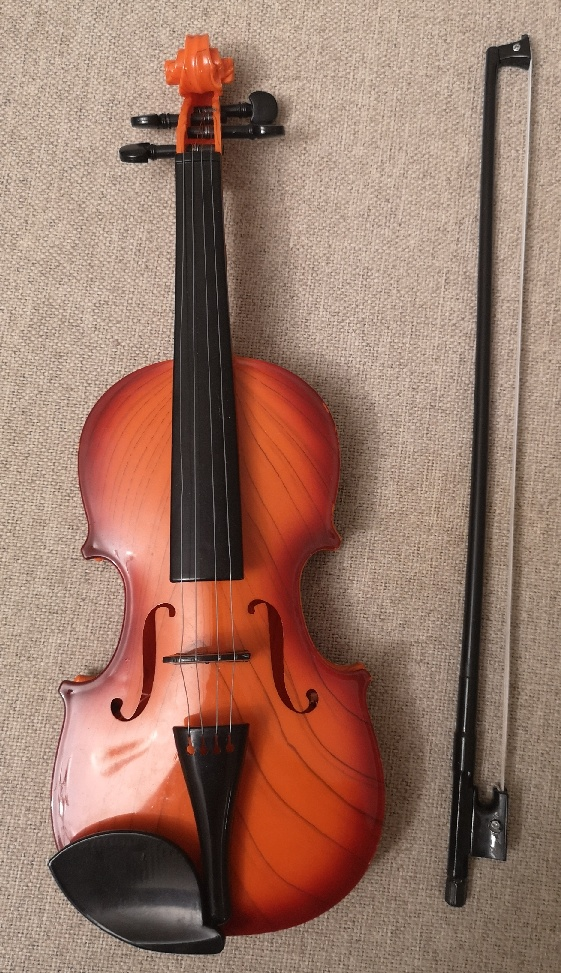
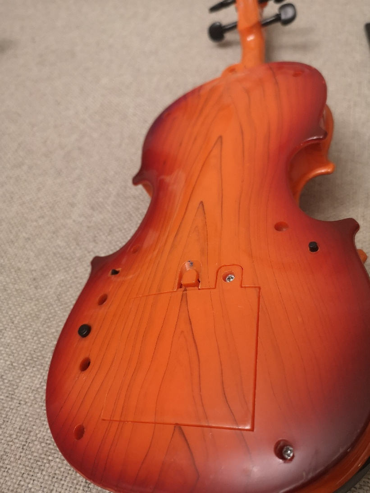
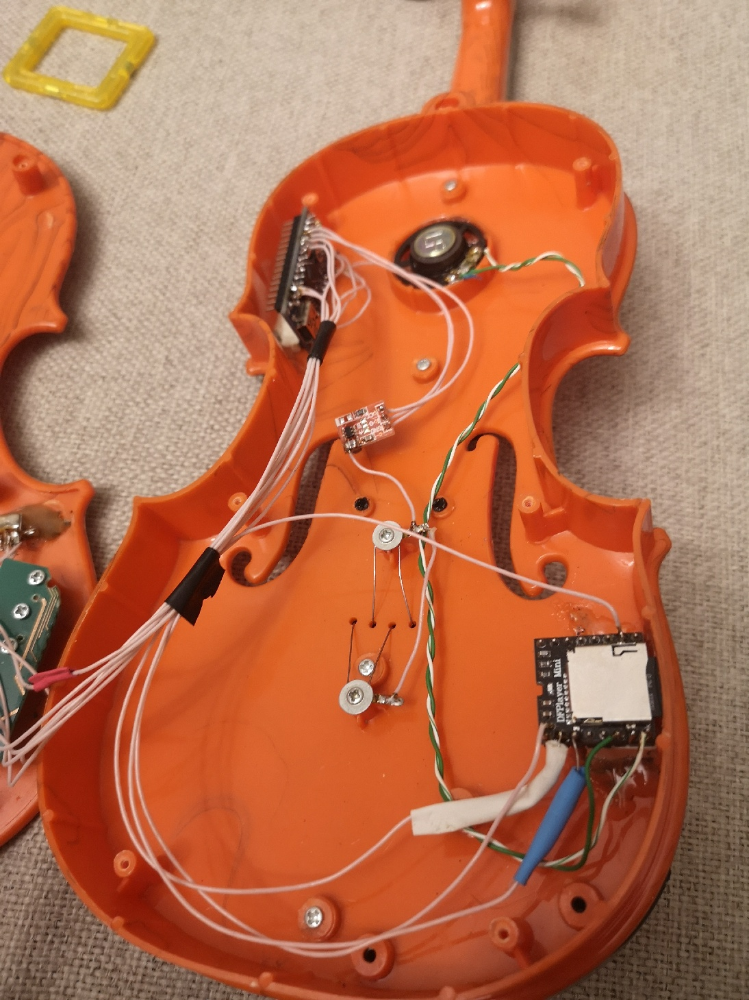
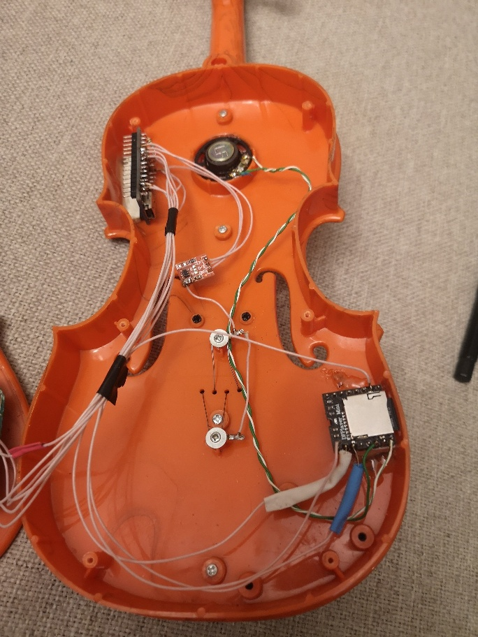
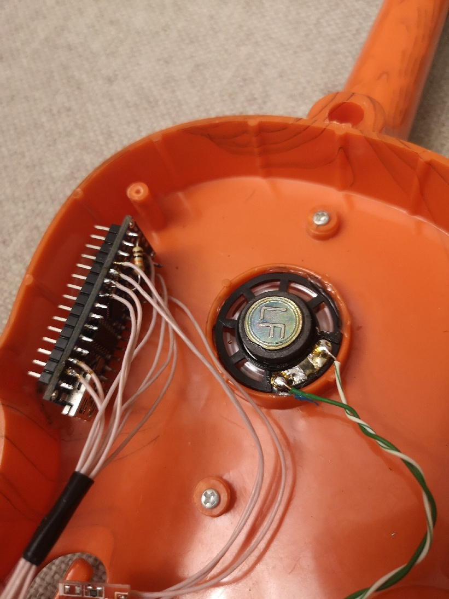
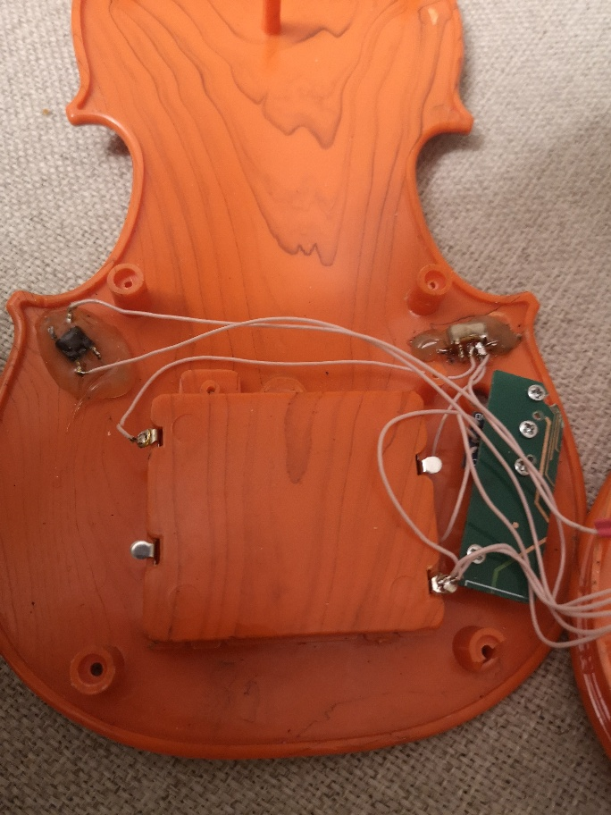
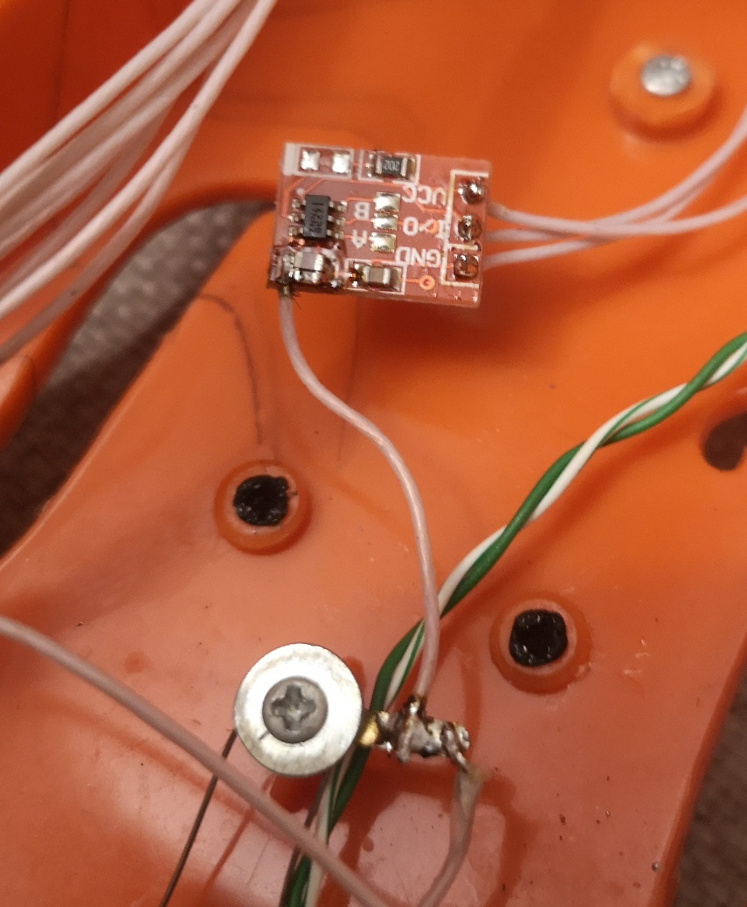
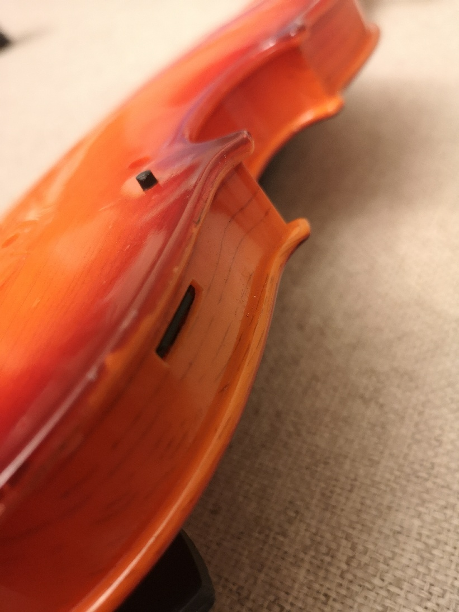
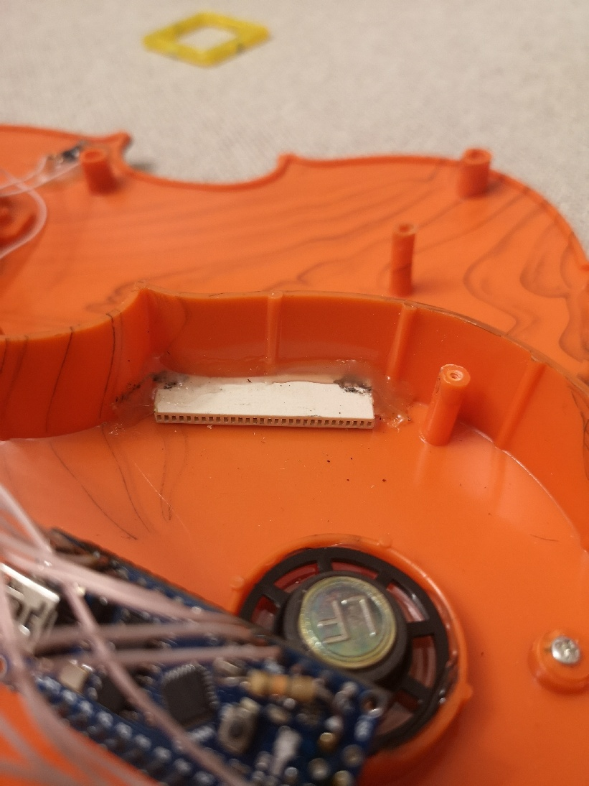
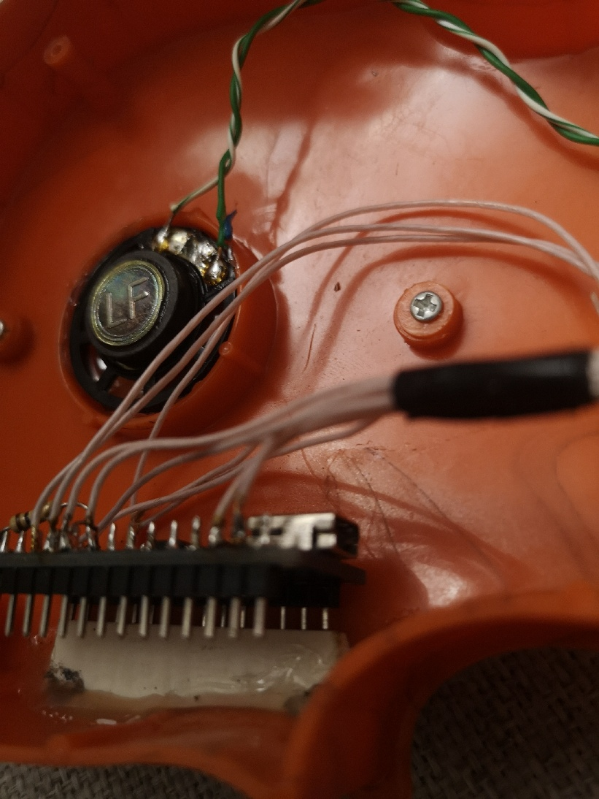

# Сенсорная скрипка на Arduino

  

### Идея:
Детская игрушка (переделанная из китайской) для воспроизведения музыки в момент зажимания струн рукой.
В одном китайском интернет-магазине была куплена детская игрушка - электрическая скрипка на трех батарейках АА. Скрипка и пластиковый смычок с резинкой от трусов вместо тетивы. Алгоритм работы был такой. Смычок используется лишь для вида, а звуки извлекаются второй рукой. При зажимании струн пальцами левой руки воспроизводилась мелодия. Одно нажимание на струны - одна нота. В памяти микросхемы около 4 или 5 мелодий. Звук теоретически напоминал скрипку, но слишком громко и резко.  
Через некоторое время было решено переделать вот это вот всё в более приемлемый вид для окружающих.

Новый алгоритм такой. При зажимании рукой струн начинает воспроизводиться mp3 мелодия. В момент отпускания струны мелодия ставится на паузу. При повторном нажимании воспроизведение продолжается. Чтобы мелодия не заикалась, пауза включается не сразу, а через полсекунды или секунду. То есть, пока держишь или перебираешь струны, мелодия воспроизводится. Остается только в такт водить смычком второй рукой. Убираешь пальцы со струн, все замолкает.  Аплодисменты. 

P.S. К сожалению китайский алгоритм понотного воспроизведения реализовать не удалось, а в принципе он тоже прикольный (кроме звука).

### Используемые детали:
- Arduino Nano, а лучше Pro Mini (для энергосбережения);
- mp3 плеер DFPlayer (китайский аналог);
- сенсорная кнопка ttp223; 
- тактовые кнопки  с длинными кнопками (чтоб длины хватило с учетом толщины корпуса) 2 шт;
- Движковый (ползунковый) выключатель с длинным рычагом (чтоб длины хватило с учетом толщины корпуса) 1 шт;
- резисторы 1кОм и 10 кОм
- конденсаторы SMD разных номиналов в диапазоне 0~50 пФ, для настройки чувствительности струн.
- провода, термоусадка, изолента и т.п.

Примечание: Динамик и батарейный отсек были уже в корпусе игрушки, поэтому я их не приобретал отдельно.

 

### Схема:

См. рисунок в папке проекта.

### Реализация: 
Подключаем модуль кнопки TTP223 к пину  D2, а сенсор припаиваем к струнам дополнительным проводом.

Подключаем кнопки 2 и 3 с подтягивающими резисторами 10 кОм  к пинам D3 и D4. 

Подключаем DFPlayer к питанию, а также RX и TX через резисторы 1кОм  к пинам D10 и D11: TX от плеера к RX Arduino, а RX плеера к TX Arduino.

Динамик подключаем к выводам DFPlayer  SPK1 и SPK2 не более 3Вт. Возможно, потребуется установить резистор 1кОм, чтобы звук был лучше.

Ставим движковый  выключатель на разрыв минусового провода от батарейного отсека.

В корпусе были просверлены отверстия под кнопки и переключатели, а одна кнопка задействована из старой схемы. Также было сделано отверстие под microSD/TF Card сбоку.

Крепление Arduino и DFPlayer’а было сделано из куска разъема PCI старой материнской платы. Я его распилил вдоль ножовкой, вытащил контакты. Нарезал по размеру. Получилась пластиковая планка с отверстиями для ножек модулей с нужным шагом. Ее на проволоку припаял к корпусу, залил термоклеем. Получился разъем, куда удобно вставлять модули. Но, поскольку в разобранном  PCI разъеме контактов уже нет, немного переделал выводы плат. Перепаял ножки таким образом, чтобы снизу была достаточная длина для вставки в импровизированный разъем, а сверху ножка тоже торчала для подпайки навесным монтажом.  

 

То же самое сделал с кнопками. На проволоку припаял к корпусу, залил термоклеем.

### Энергосбережение
- После полной отладки и тройной перепроверки выпаял светодиоды RX, TX, LED13 и питания с Arduino.
- Подключил питание через VIN в обход стабилизатора напряжения.
- Стандартные батарейки заменил на первые попавшиеся аккумуляторы размера AA. Плата питается от 4,5В. Этого достаточно.
- Также в скетч добавлена функция увода Arduino в сон. 
DFPlayer победить не удалось. После ухода в сон, он отказывался возвращаться в нормальный режим, а лишь полностью перезагружался, что не подошло мне. Поэтому отказался от этого.

### Подводные камни:
Это был мой первый проект, поэтому я не стал делать печатную плату, а все сделано навесным монтажом с максимальным колхозингом. При этом проект несколько раз переделывался. 

Основная сложность была с сенсорными струнами. Сначала сенсор был реализован силами самой Arduino  через библиотеку CapacitiveSensor. Срабатывания сенсора были не предсказуемыми. В какой-то момент подвернулась красная сенсорная кнопка TTP223. Удобство заключается в том, что на плате сразу распаяна микросхема с автоподстройкой сенсора и возможностью за счет добавления конденсатора регулировать чувствительность сенсора. Также можно подпаяться к сенсору со специальной площадки или сразу на конденсатор.

Кстати, с автоподстройкой есть один неприятный момент. Кнопка самокалибруется при подаче питания. В даташите написано, что первые 0,5 секунды нельзя касаться кнопки.  Если включаешь питание игрушки, при этом держась рукой за струны -  струны перестают работать до следующей автокалибровки. Надо просто отпустить струны и подождать пару секунд. Та же история, когда на пластиковом корпусе накапливается статика. Но вообще в реальной жизни это не сильно портит удовольствие и случается редко.

Еще один нюанс, это при подборе конденсатора для кнопки TTP223 необходимо тестировать чувствительность сенсорных струн  именно в собранном корпусе. Иначе может быть такая ситуация, что струны начнут срабатывать на расстоянии нескольких сантиметров от руки или наоборот, только если браться за них двумя руками. На чувствительность влияет всё. И корпус и длина струн, и длина провода от сенсорной кнопки, припаянной к струнам. Поэтому я и не указал емкость конденсатора. На фотографии видно, что у меня запаяны два конденсатора в параллель, потому что не оказалось нужной емкости. Кстати конденсаторы были выпаяны из старой материнской платы компьютера. Проблема smd конденсаторов, что по ним никак не определить номинал. Благо нашелся правильный мультиметр. Из 40 конденсаторов с материнки нашел два подходящих, и то пришлось запараллелить.   Диапазон конденсаторов настройки из даташита на TTP223 0~50пФ. 

Mp3 модуль DFPlayer также оказался с особенностями. Поскольку у меня был китайский аналог, то возникали проблемы с управлением. В итоге реализована самая простая схема без обратной связи и энергосбережения. Просто отдаем команды плееру от Arduino без обратной связи. Библиотека DFRobotDFPlayerMini не во всех версиях оказалась совместима с модулем плеера. В итоге методом тыка подошла версия 1.0.5 с ограничениями. Ну и еще неприятный момент, связанный с невнимательностью – ошибка полярности или подача напряжения на неправильные пины убивают модуль плеера сразу без возможности восстановления. В Ардуине можно хотя-бы диод шоттки заменить или регулятор напряжения.  
